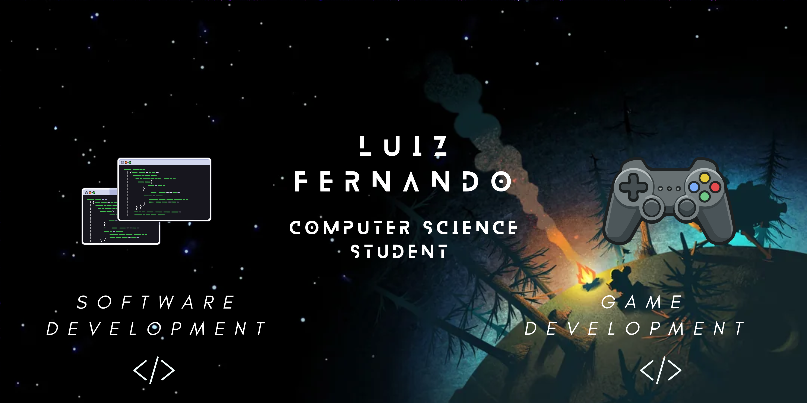
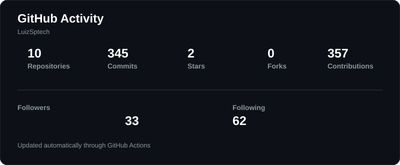
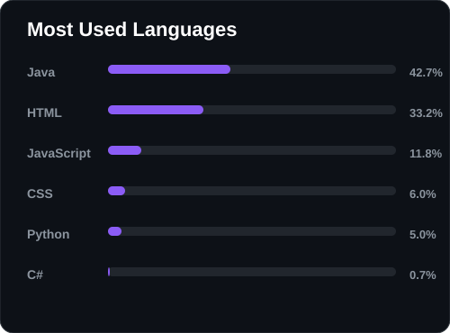

  

 

<h3 align="left">
Olá! Meu nome é Luiz Fernando. 🎓  
Sou formado em Técnico em Análise e Desenvolvimento de Sistemas pelo SENAI e atualmente curso Ciência da Computação na SPTech.  
💻 Tenho interesse em programação e desenvolvimento de software, sempre buscando aprender novas tecnologias e aprimorar minhas habilidades.  
🎮 Também tenho interesse em desenvolvimento de jogos, estudando ferramentas como Unity e C#.
</h3>

###

  

  

###

<h2 align="left">Tecnologias</h2>

<h3 align="left">Linguagens</h3>

  
  

  
  

  
  

  
  

  
  

  

<h3 align="left">Desenvolvimento</h3>

  
  

  
  

  
  

  
  

  

<h3 align="left">Cloud & Infraestrutura</h3>

  
  

  
  

  

###

<h2 align="left">Projetos</h2>

### [AcervoRPG](https://github.com/LuizSptech/ACERVO-RPG)

Um projeto voltado para o universo de RPG, onde o usuário pode descobrir seu próprio estereótipo dentro do RPG e compartilhar momentos especiais vividos em histórias.

<b>Tecnologias:</b> Node.js • MySQL • JavaScript • HTML • CSS

### [ArqComp_Jogo](https://github.com/LuizSptech/ArqComp_Jogo)

Um quiz de Arquitetura Computacional apresentado como um RPG de turnos, inspirado nos jogos clássicos de Pokémon.

<b>Tecnologias:</b> HTML • CSS • JavaScript

###

<h2 align="left">Contato</h2>

  

